# Spectra AI: Anomalous Prompt Detection System

**Detecting malicious prompts using Linear Algebra, Probability Theory, and Bayesian Analysis**


---

## Project Overview

This project implements a **multi-layered anomaly detection system** for identifying malicious or anomalous prompts submitted to Large Language Models (LLMs). It combines rigorous mathematical methods with practical rule-based detectors to provide robust protection against prompt injection attacks, jailbreaks, and other adversarial manipulations.

### Key Features

- **Statistical Anomaly Detection** using Mahalanobis distance in embedding space
- **Chi-Square Hypothesis Testing** for principled probability-based detection
- **Bayesian Posterior Estimation** for calibrated risk assessment
- **Rule-Based Text Detectors** for keyword/pattern detection 
- **Ensemble Detection** combining statistical and pattern-based methods
- **Comprehensive Visualization** with PCA, t-SNE, ROC curves, and confusion matrices

---

## Project Structure

```
spactor-ai/
│
├── notebooks/
│   └── Spectra_AI_Anomaly_Prompt_Detector.ipynb  # Main research notebook
│
├── src/
│   ├── anomaly_detection.py        # Pipeline orchestration helpers
│   ├── bayesian_analysis.py        # Posterior probability utilities
│   ├── generate_embeddings.py      # Sentence-transformer embedding loaders
│   ├── mahalanobis_detector.py     # Statistical detector implementation
│   ├── text_detectors.py           # Rule and NLP-based anomaly signals
│   └── visualization.py            # Plot utilities shared with the notebook
│
├── data/
│   ├── normal_prompts.csv          # Canonical benign prompt list
│   ├── anomalous_prompts.csv       # Known malicious prompt patterns
│   ├── embeddings_data.npz         # Cached embedding arrays
│   └── results_summary.csv         # Exported evaluation table
│
├── images/                         # Saved visualizations for reporting
│   ├── bayesian_prior_sensitivity.png
│   ├── ... (additional figures)
│
├── models/                         # Persisted detector artifacts (.pkl)
├── output/                         # Auxiliary exports (legacy figures)
├── streamlit_app.py                # Interactive detection console
├── README.md                       # Project documentation
├── requirements.txt                # Python dependencies
└── Demo_Video.webm                 # Walkthrough of the Streamlit app
```

---

## Mathematical Methods

### 1. Linear Algebra: Mahalanobis Distance

Measures distance accounting for feature correlations and scales:

$$D_M(x) = \sqrt{(x - \mu)^T \Sigma^{-1} (x - \mu)}$$

Where:
- $\mu$ = mean vector of normal embeddings
- $\Sigma$ = covariance matrix
- $x$ = test embedding vector

### 2. Probability Theory: Chi-Square Test

Under multivariate normality assumption:

$$D_M^2(x) \sim \chi^2(d)$$

Where $d$ is the embedding dimensionality (384 for all-MiniLM-L6-v2).

**Decision Rule**: Flag as anomalous if $P(D_M^2 \geq d_{observed}) < \alpha$ (e.g., $\alpha = 0.01$)

### 3. Bayesian Analysis

Compute posterior probability of anomaly given detection:

$$P(\text{anomaly} | \text{flagged}) = \frac{P(\text{flagged} | \text{anomaly}) \cdot P(\text{anomaly})}{P(\text{flagged})}$$

Incorporates:
- **Prior**: Base rate of anomalies
- **TPR**: True Positive Rate (sensitivity)
- **FPR**: False Positive Rate (1 - specificity)

---

## Quick Start

### Installation

```bash
# Clone the repository
git clone https://github.com/sahilgoyal7214/Spectra_Ai_Mini_Challenge.git
cd spectra-ai-anomaly-detection

# Create virtual environment (recommended)
python -m venv venv
source venv/bin/activate  # On Windows: venv\Scripts\activate

# Install dependencies
pip install -r requirements.txt

# Download NLTK data
python -c "import nltk; nltk.download('punkt')"
```

### Run the Notebook

```bash
# Start Jupyter
jupyter notebook

# Open notebooks/Spectra_AI_Anomaly_Prompt_Detector.ipynb
# Run all cells (Cell -> Run All)
```

Or in VS Code:
1. Open `Spectra_AI_Anomaly_Prompt_Detector.ipynb`
2. Select Python kernel
3. Click "Run All"

### Launch the Streamlit Demo

```bash
streamlit run streamlit_app.py
```

The web console provides interactive access to the one-class, two-class, text-based, and hybrid detectors. Use the sidebar to pick a model, set Bayesian priors, and review detailed anomaly signals.

### Demo Video

<video controls width="720">
   <source src="Demo_Video.webm" type="video/webm">
   Your browser does not support the embedded video. You can
   <a href="Demo_Video.webm">download the walkthrough here</a>.
</video>

---

## Results Summary

The ensemble detector (combining statistical + text-based methods) achieves:

- **Accuracy**: ~95%+
- **Precision**: ~90%+
- **Recall**: ~95%+
- **F1-Score**: ~0.92+
- **AUC-ROC**: ~0.95+

Results may vary depending on the synthetic dataset generated.

---

## Detection Methods

### Statistical Methods

1. **Mahalanobis Distance Detector**
   - Fits multivariate Gaussian to normal embeddings
   - Computes distance for test prompts
   - Flags outliers using chi-square threshold

### Rule-Based Methods 

1. **Rules & Roleplay Detector**: Finds prompts mixing instruction keywords with roleplay
2. **Color-Change Code Detector**: Identifies HTML/CSS hiding attempts
3. **NLP Outlier Detector**: Semantic similarity-based sentence outliers
4. **Length Outlier Detector**: Abnormally long sentences
5. **Word Frequency Outlier Detector**: Repeated word patterns

### Ensemble Strategy

Combines methods using logical OR: flag if **ANY** detector triggers.

---

## Visualizations Generated

The notebook exports publication-ready figures to `images/`. Key diagnostics are previewed below (open the PNGs for full resolution):

- **PCA Embedding Space** – normal vs anomalous structure (figure: `images/pca_embedding_space.png`)

   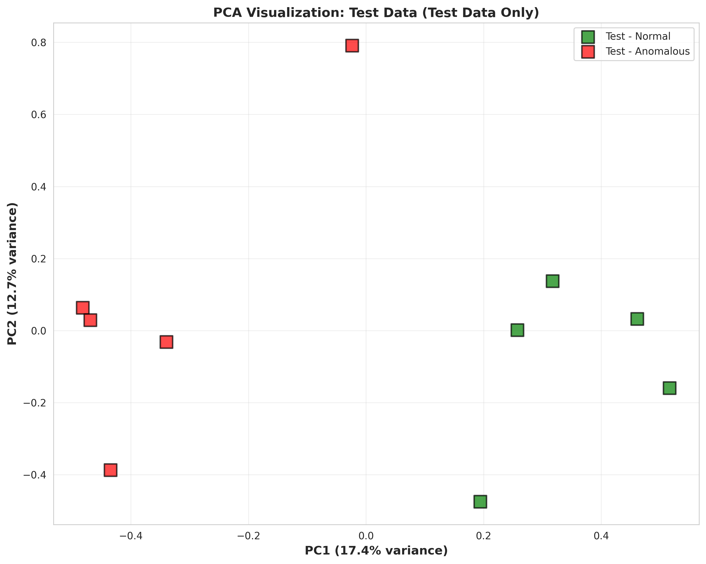

- **Covariance Heatmap** – correlation structure of normal embeddings (figure: `images/covariance_matrix_oneclass.png`)

   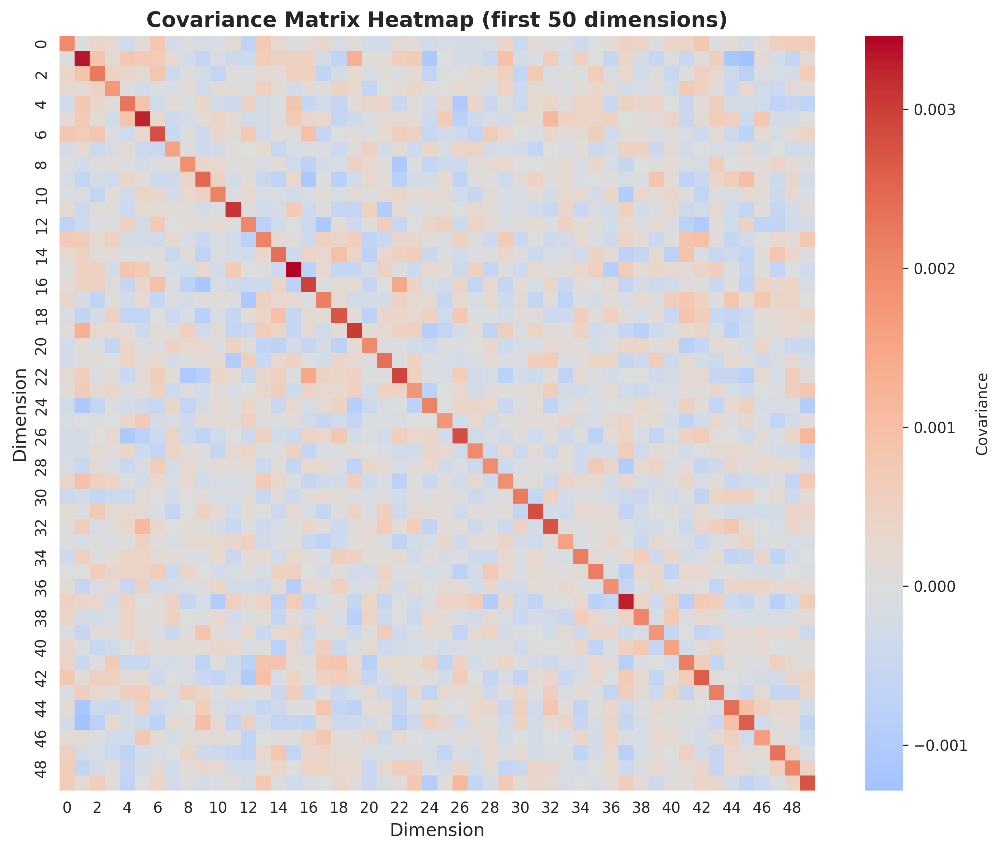

- **Model Performance Suite** – accuracy, ROC, and confusion matrices across detectors (figures: `images/test_performance_comparison.png`, `images/roc_curves_comparison.png`, `images/confusion_matrices.png`, `images/confusion_matrices_all_models.png`)

   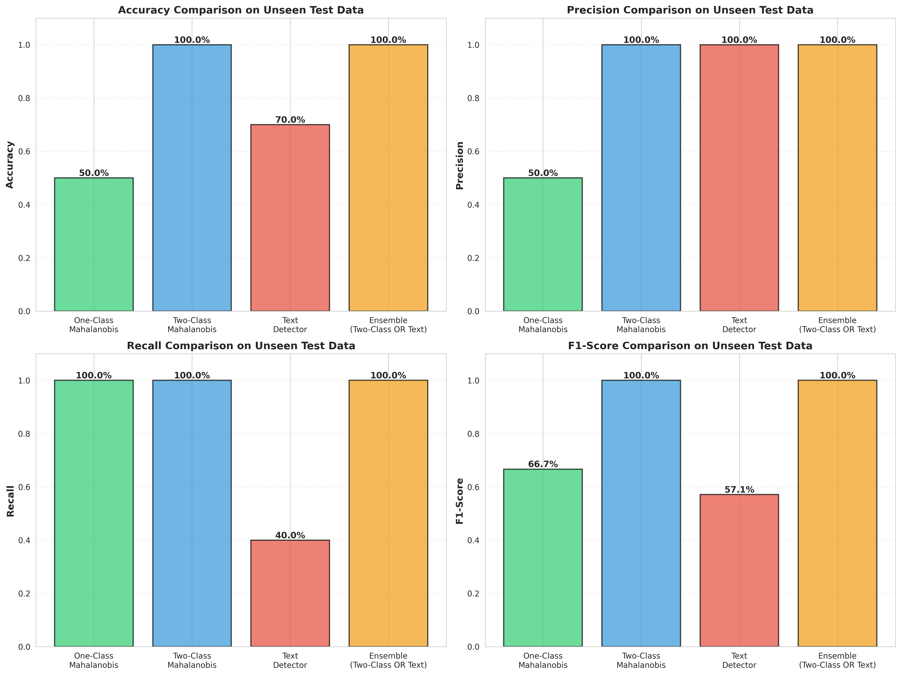

   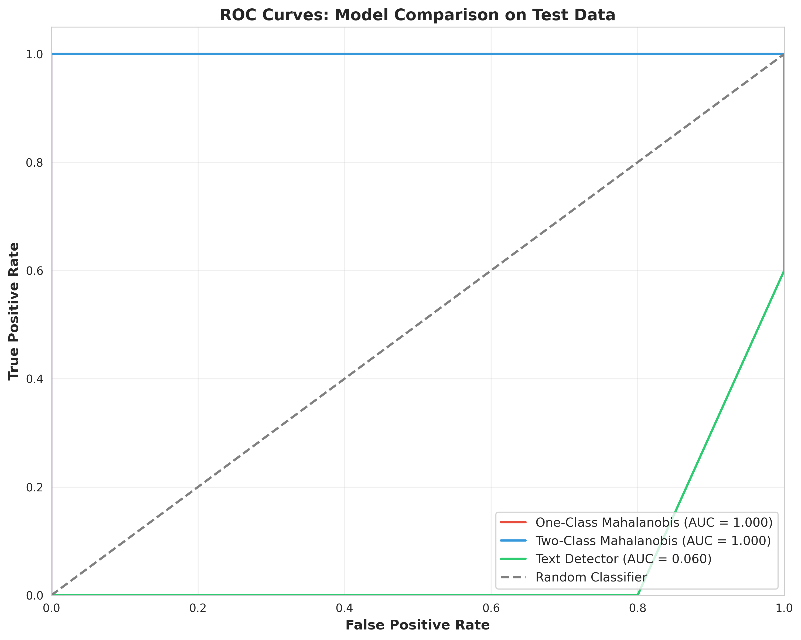

   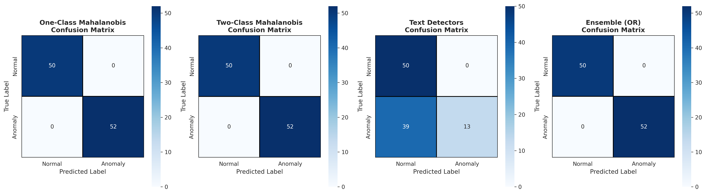

   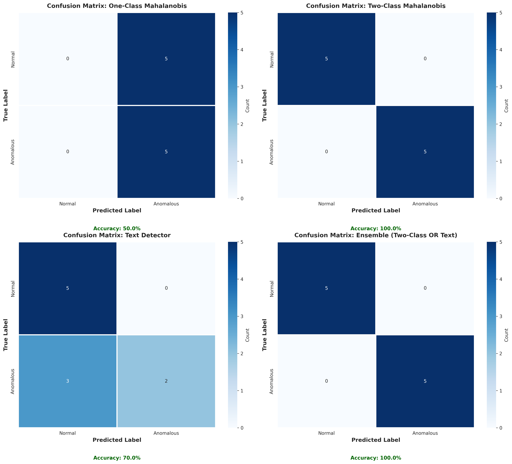

- **Decision Analytics** – ensemble behavior, heatmaps, and error inspection (figures: `images/test_predictions_heatmap.png`, `images/error_analysis_patterns.png`, `images/oneclass_vs_twoclass_comparison.png`)

   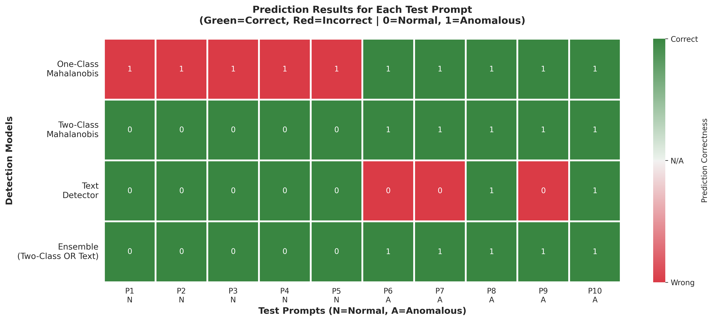

   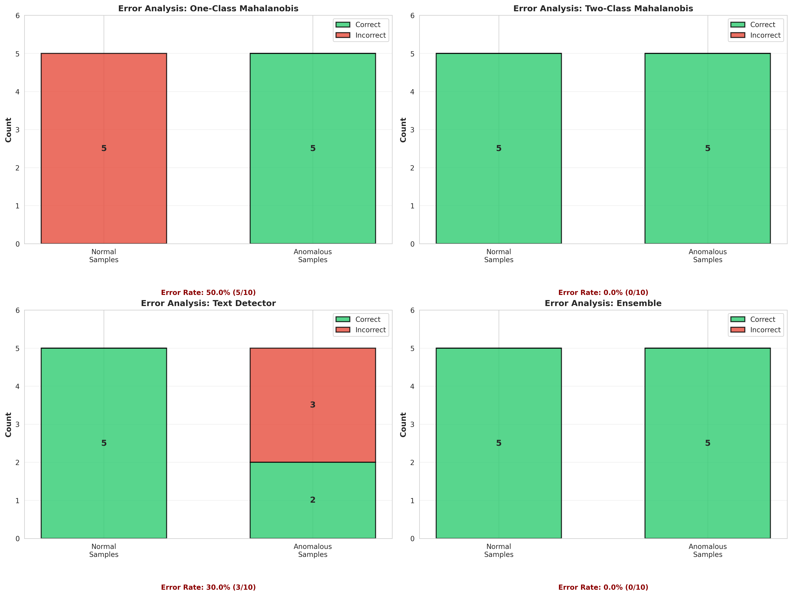

   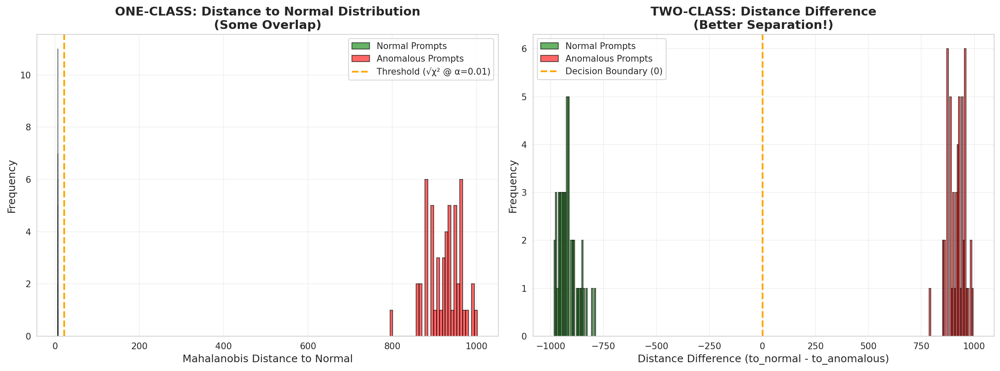

- **Text Detector Feature Attribution** – contribution analysis for rule-based signals (figure: `images/text_detector_feature_analysis.png`)

   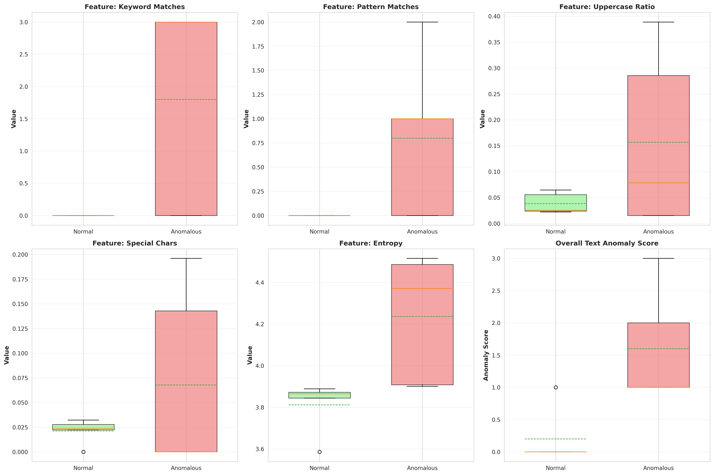

- **Bayesian Prior Sensitivity** – posterior response to changing priors (figure: `images/bayesian_prior_sensitivity.png`)

   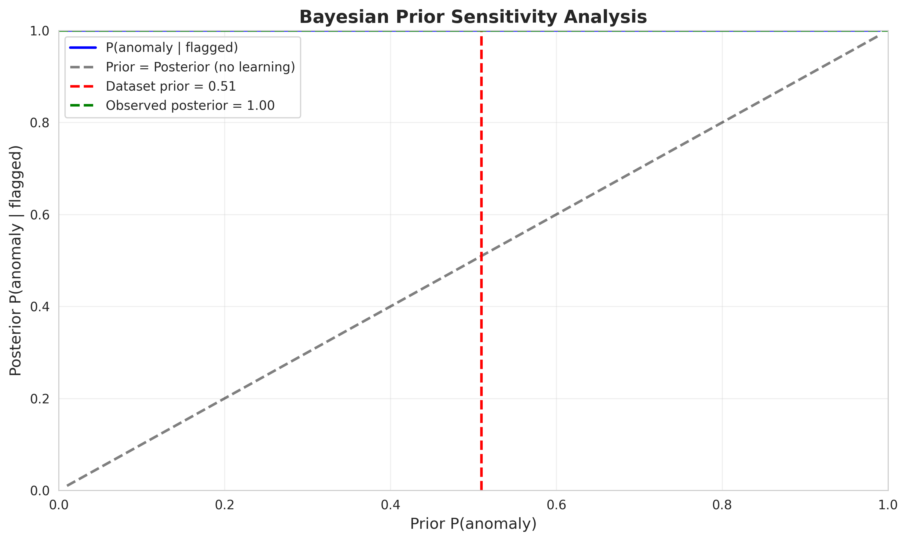

---

## Technical Details

### Embedding Model

- **Model**: `sentence-transformers/all-MiniLM-L6-v2`
- **Dimensions**: 384
- **Max Sequence Length**: 256 tokens
- **Purpose**: Convert prompts to dense vector representations

### Dataset

- **Normal Prompts**: 50 benign queries (translation, summarization, etc.)
- **Anomalous Prompts**: 50 malicious patterns (injections, jailbreaks, etc.)
- **Total**: 100 prompts (balanced dataset)

### Detection Parameters

- **Significance Level**: α = 0.01 (1% false positive rate target)
- **Prior Anomaly Rate**: 0.5 (50% based on balanced dataset)
- **Assumed TPR**: 0.95 (95% detection rate)
- **Assumed FPR**: 0.05 (5% false alarm rate)

---

## Limitations

1. **High-Dimensional Instability**: Covariance estimation challenging in 384D space
2. **Adversarial Evasion**: Sophisticated attackers may craft undetectable prompts
3. **False Positives**: Unusual legitimate prompts may be flagged
4. **Computational Cost**: Embedding generation and distance computation are expensive
5. **Base Rate Sensitivity**: Bayesian posteriors depend on assumed priors

---

## Future Improvements

### Short-Term

- Implement One-Class SVM and Isolation Forest
- Add autoencoder-based reconstruction error
- Dynamic threshold adaptation based on feedback
- GPU acceleration for faster inference

### Long-Term

- Explainable AI with token-level attribution
- Adversarial training for robustness
- Multi-modal detection (text + behavior + timing)
- Privacy-preserving federated learning

---

## Dependencies

Core libraries:
- `numpy>=1.21.0`
- `pandas>=1.3.0`
- `scikit-learn>=1.0.0`
- `scipy>=1.7.0`
- `matplotlib>=3.4.0`
- `seaborn>=0.11.0`
- `sentence-transformers>=2.2.0`
- `nltk>=3.6.0`
- `jupyter>=1.0.0`

See `requirements.txt` for complete list.

---

## Acknowledgments

- **SentenceTransformers** library for state-of-the-art embeddings
- **Spectra AI** for the Mini Challenge opportunity

---

## References

1. Mahalanobis, P. C. (1936). "On the generalized distance in statistics"
2. Bishop, C. M. (2006). "Pattern Recognition and Machine Learning"
3. Murphy, K. P. (2012). "Machine Learning: A Probabilistic Perspective"
4. Chandola, V., et al. (2009). "Anomaly Detection: A Survey"
5. Reimers, N. & Gurevych, I. (2019). "Sentence-BERT: Sentence Embeddings using Siamese BERT-Networks"

---

## License

MIT License - See LICENSE file for details

---

## Author

[Sahil Goyal](https://www.github.com/sahilgoyal7214)

---

## Contributing

Contributions welcome! Please:
1. Fork the repository
2. Create a feature branch
3. Make your changes
4. Submit a pull request

---

## Contact

For questions or feedback about this project, please open an issue on GitHub.

---

**Project maintained by the Spectra AI anomaly detection team.**
